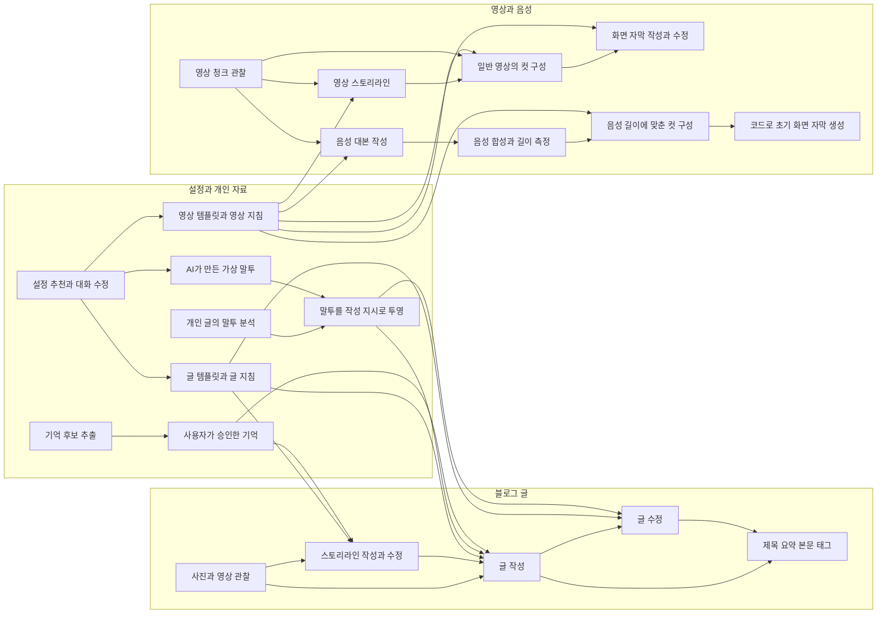
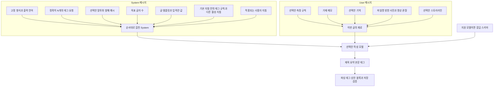

# PostPilot 프롬프트 지도

확인 기준: 2026-10-07, 현재 `main`의 `95da3ad4`. 실행 코드와 호출부를 추적한 지도다. 별도 작업 공간의 미통합 변경과 실제 배포 상태는 이 지도의 확인 범위에 포함되지 않는다.

프롬프트는 기능별로 조립된다. 글 작성의 **System에는 코드가 정한 형식뿐 아니라 개인 말투·템플릿·기본 지침·사용자 지침도 함께 들어간다.** User에는 이번 작업의 메모·관찰·기억 등이 들어간다. 따라서 System/User라는 전송 역할과 코드 소유/사용자 소유라는 출처를 따로 봐야 한다.

## 전체 기능 지도

사각형의 AI 단계는 실제 텍스트 모델 호출이다. 말투 투영과 저장된 설정의 읽기는 모델 호출이 아니다. TTS와 음성 디자인은 텍스트 chat의 System/User 구조를 사용하지 않는다.



이 그림은 기능 간 관계의 개요다. 글 수정에는 최초 작성의 메모·관찰·기억 전체가 다시 들어가지 않으며, 음성 영상은 일반 자막 작성 호출 대신 초기 자막을 코드로 만든다. 각 차이는 아래 목록에 구분했다.

## 글 작성 한 번에 들어가는 내용



- 조립 함수: [BuildWritePromptForLanguage](/home/hrlee/project/postpilot/backend/internal/generation/prompts.go:402).
- 모델 요청 구성: [writeCandidate](/home/hrlee/project/postpilot/backend/internal/generation/write.go:22).
- 실제 provider 메시지 구성: [buildRequest](/home/hrlee/project/postpilot/backend/internal/llm/openaicompat/client.go:214).
- 템플릿 입력값은 [writeTemplateSection](/home/hrlee/project/postpilot/backend/internal/generation/prompts.go:199)이 받는, 이미 해석된 템플릿 본문에 포함된다. 해당 값의 실제 전송 역할은 System이다.

실제 문자열의 순서는 System에서 고정 형식 → 태그 개수·언어 → 말투·길이 → 템플릿 → 작문 지침이다. User는 선택한 측정 규칙 → 가제·메모 → 기억 → 첨부 관찰 → 선택적 스토리라인이다. 없는 항목은 생략된다.

태그를 작성하는 별도 모델 호출은 없다. 글을 작성하는 한 응답에 `title`, `summary`, `tags`, `blocks`가 함께 들어간다.

## 최근 태그 커밋을 확인하는 다섯 위치

변경 커밋은 `995bcee9`, 2026-10-07 02:13:40 KST, `fix(generation): prioritize grounded targeted post tags`다. [T612 기록](/home/hrlee/project/postpilot/spec/tasks/done/T612.targeted-post-tags.md)과 함께 확인할 수 있다.

| 확인하려는 내용 | 실제 위치 | 역할 |
|---|---|---|
| 태그를 생성하라는 요청 | [prompts.go:408](/home/hrlee/project/postpilot/backend/internal/generation/prompts.go:408) | 한국어 System에 `정확히 N개의 tags` 요구. 영어는427행 |
| 어떤 태그를 고를지 | [defaults.go:146](/home/hrlee/project/postpilot/backend/internal/guideline/defaults.go:146) | `tags` 기본 지침. 상호·장소·브랜드·제품, 지역+메뉴·활동 등을 우선 |
| 범용 태그로 개수 채우기 방지 | [defaults.go:150](/home/hrlee/project/postpilot/backend/internal/guideline/defaults.go:150) | 범용 태그를 후순위로 두고 개수 채우기용으로 추가하지 말라는 문구. 모든 범용 태그를 금지한 것은 아님 |
| 활성 지침을 결정하는 곳 | [ForPrompt](/home/hrlee/project/postpilot/backend/internal/guideline/service.go:254) | 계정의 켜기/끄기, 언어, 적용 대상에 맞는 지침 선택 |
| 모델 답변의 태그를 읽는 곳 | [parse.go:209](/home/hrlee/project/postpilot/backend/internal/generation/parse.go:209) | 개수가 많으면 앞 N개로 자름. 더 적거나 빈 배열인 결과는 허용 |

실제 문구는 다음과 같다. 두 문구가 서로 다른 파일에서 합쳐진다.

```text
[태그 개수 요청: generation/prompts.go]
title, 한 줄 summary, 정확히 N개의 tags, blocks를 반환하세요.

[태그 선택 기준: guideline/defaults.go]
tags는 이 글을 찾는 사람이 검색할 법한 구체적인 이름과 자연스러운 조합으로 고르세요.
… 범용적인 태그는 구체적인 태그보다 후순위로 두고,
태그 수를 채우려고 덧붙이지 마세요.
```

커밋은 기존 `tags` 기본 지침의 한국어·영어 원문과 작성·수정 golden을 바꿨다. 태그 개수 요청, 응답 스키마, 후처리, 프런트엔드는 바꾸지 않았다.

### 적용 조건과 우선순위

- 태그 기본 지침을 계정에서 껐으면 선택 기준은 들어가지 않는다. 개수 요청은 남는다.
- 사용자 지침이 기본 지침과 충돌하면 사용자 지침을 따르라고 모델에 설명한다. 같은 묶음에서는 먼저 적힌 지침이 우선이다. 이 순서는 모델에 주는 지시이며 의미적 준수를 코드가 보장하는 것은 아니다. [우선순위 문구](/home/hrlee/project/postpilot/backend/internal/generation/prompts.go:236)
- 기본 지침 원문은 작업 시작 때 payload에 확정된다. 이미 대기 중인 작업의 예전 지침이 코드 수정만으로 바뀌지는 않는다. [자료 확정](/home/hrlee/project/postpilot/backend/internal/generation/service.go:400), [payload](/home/hrlee/project/postpilot/backend/internal/generation/generation_payload.go:44)
- 일반 작성·스토리라인 후 작성·모델 비교는 `writeCandidate`를 공유한다. 글 수정은 별도 프롬프트 조립 함수에 같은 지침을 넣는다. [글 수정](/home/hrlee/project/postpilot/backend/internal/generation/revise.go:122), [모델 비교](/home/hrlee/project/postpilot/backend/internal/generation/experiment_surface.go:154)
- 글 수정은 태그 변경 요청이 있을 때만 다시 고르라고 지시한다. 사용자가 요청하지 않은 태그를 그대로 유지했는지 코드가 별도로 검사하지는 않는다. [수정의 기본 지시](/home/hrlee/project/postpilot/backend/internal/generation/revise.go:37)

### 무엇이 검증되고 무엇이 아직 평가되지 않았는가

| 검증 층 | 현재 확인되는 것 | 현재 확인하지 않는 것 |
|---|---|---|
| 프롬프트 조립 테스트 | 켰을 때 지침이 한 번 들어감, 껐을 때 빠짐, KO/EN 작성·수정 조립 | 실제 모델이 구체적인 태그를 선택했는지 |
| 응답 스키마 | 문자열 배열인 `tags` | 사실 근거·본문 관련성·태그 구체성·정확한 개수 |
| 파서 | 초과하면 앞 N개 유지, 부족하면 그대로 허용 | 범용 태그 제거·검색 수요·의미상 중복 |
| 최종 저장 검증 | 빈 태그와 정규화 기준 동일 태그 거절 | 공백 유무만 다른 표현의 의미상 중복, 근거 없는 지역·메뉴 |
| 실사용 평가 | 이번 조사에서는 수행하지 않음 | 실모델 품질 개선, 발행 후 조회·검색 유입 변화 |

태그 저장 검증은 [post/content_edit.go:25](/home/hrlee/project/postpilot/backend/internal/post/content_edit.go:25)에 있다. 입력 태그의 선행 `#`와 앞뒤·연속 공백 등을 정규화해 비교하지만 `답십리떡볶이`와 `답십리 떡볶이`를 같은 의미의 태그로 취급하지는 않는다.

## 전체 프롬프트 코드 목록

### 블로그 글과 글의 재료

| 단계 | System의 출처 | User의 재료와 결과 | 실제 호출·조립 코드 |
|---|---|---|---|
| 사진 관찰 | `ObservePrompt` | 파일명을 붙인 사진 bytes → 사실 관찰. 메모·제목·말투 없이 관찰 | [prompts.go:13](/home/hrlee/project/postpilot/backend/internal/generation/prompts.go:13), [observe.go:87](/home/hrlee/project/postpilot/backend/internal/generation/observe.go:87) |
| 첨부 영상 관찰 | `ObserveVideoPrompt` | 첨부 영상과 파일명 → 장면·움직임·소리 관찰 | [prompts.go:35](/home/hrlee/project/postpilot/backend/internal/generation/prompts.go:35), [observe.go:160](/home/hrlee/project/postpilot/backend/internal/generation/observe.go:160) |
| 스토리라인 생성·수정 | 이야기 계획 형식·템플릿·작문 지침. 말투 없음 | 메모·관찰·선택한 기억·현재 스토리/수정 요청 → 계획 JSON | [storyline_prompts.go:64](/home/hrlee/project/postpilot/backend/internal/generation/storyline_prompts.go:64), [storyline.go:229](/home/hrlee/project/postpilot/backend/internal/generation/storyline.go:229) |
| 바로 글 작성 | 형식·태그 개수·언어·말투·템플릿·지침 | 이번 글 재료 → storyline를 먼저 포함한 글 JSON. 한 번의 작성 응답 | [prompts.go:402](/home/hrlee/project/postpilot/backend/internal/generation/prompts.go:402), [write.go:34](/home/hrlee/project/postpilot/backend/internal/generation/write.go:34) |
| 스토리라인 후 글 작성 | 위 조립에서 전용 형식·스토리 제한 선택 | 확정 스토리와 해당 재료 → 글 JSON. 새 storyline는 요구하지 않음 | [prompts.go:459](/home/hrlee/project/postpilot/backend/internal/generation/prompts.go:459), [write.go:41](/home/hrlee/project/postpilot/backend/internal/generation/write.go:41) |
| 글 수정 | 수정 범위·언어·말투·템플릿·지침 | 현재 PostContent·첨부 파일명/방향·요청 → 전체 PostContent. 원래 메모·관찰·기억 전체를 다시 주지 않음 | [revise.go:122](/home/hrlee/project/postpilot/backend/internal/generation/revise.go:122), [revise_handler.go:49](/home/hrlee/project/postpilot/backend/internal/generation/revise_handler.go:49) |
| 작성 모델 비교 | 같은 작성 builder | 확정된 post·말투·관찰 snapshot에서 각 후보를 작성 | [experiment_surface.go:154](/home/hrlee/project/postpilot/backend/internal/generation/experiment_surface.go:154), [experiment_snapshot.go:40](/home/hrlee/project/postpilot/backend/internal/generation/experiment_snapshot.go:40) |
| 기억 후보 추출 | `ExtractionPrompt`, 한국어 고정 | 제목·메모·평탄화 글 → 기억 후보. 사용자 승인 후 기억으로 저장 | [extraction.go:67](/home/hrlee/project/postpilot/backend/internal/memory/extraction.go:67), [extraction.go:115](/home/hrlee/project/postpilot/backend/internal/memory/extraction.go:115) |
| 선택한 발행 글 측정 규칙 | 추가 모델 호출 없음. 선택한 규칙을 작성 User 앞쪽에 붙임 | 최근 제목·반복 문구 회피, 본문 반복·블록 구성 규칙. 작문 지침과 충돌하면 지침 우선 | [quality/rules.go:13](/home/hrlee/project/postpilot/backend/internal/quality/rules.go:13), [qualityRulesSection:268](/home/hrlee/project/postpilot/backend/internal/generation/prompts.go:268) |

### 설정 만들기와 말투

| 단계 | System과 코드 소유 안내 | User 재료·출력 | 실제 코드 |
|---|---|---|---|
| 설정 추천·대화 수정 | 공통 `authoringSystem` | 종류·목적·요청·현재 초안·최근 대화·형식 guide → 추천8개 또는 수정artifact와 설명 | [authoring/run.go:69](/home/hrlee/project/postpilot/backend/internal/authoring/run.go:69), [modelMessage:140](/home/hrlee/project/postpilot/backend/internal/authoring/run.go:140), [호출:216](/home/hrlee/project/postpilot/backend/internal/authoring/run.go:216) |
| 글 템플릿의 형식 guide | 코드 안내이며 위 호출의 **User JSON**에 포함 | 글 템플릿 문법과 현재 초안 | [template/guide.go:40](/home/hrlee/project/postpilot/backend/internal/template/guide.go:40), [authoring.go:62](/home/hrlee/project/postpilot/backend/internal/template/authoring.go:62) |
| 영상 템플릿의 형식 guide | 같은 authoring 호출의 User JSON | 영상 구성 문법과 제한 | [clip/app/authoring.go:45](/home/hrlee/project/postpilot/backend/internal/clip/app/authoring.go:45) |
| 글·영상 지침 설정 guide | 같은 authoring 호출의 User JSON | 작성 방향, 이름/본문 한도, 다른 설정을 바꾸지 않는 규칙 | [guideline/authoring.go:78](/home/hrlee/project/postpilot/backend/internal/guideline/authoring.go:78) |
| 말투 설정 guide | 같은 authoring 호출의 User JSON | 가상 산책·차 장면의 예시. 기존 말투를 참고할 때 분석된 스타일을 사용 | [voice/authoring.go:82](/home/hrlee/project/postpilot/backend/internal/voice/authoring.go:82), [Seed:53](/home/hrlee/project/postpilot/backend/internal/voice/authoring.go:53) |
| 별도 템플릿 요청 경로 | 형식 guide+요청 규칙 | 요청·템플릿 초안·참고글. 교정 시 직전 assistant 응답과 오류 추가 | [request_prompts.go:57](/home/hrlee/project/postpilot/backend/internal/template/request_prompts.go:57), [request.go:256](/home/hrlee/project/postpilot/backend/internal/template/request.go:256) |
| 별도 AI 말투 후보 경로 | `candidateSystem`과 가상 장면 | 코드 방향8개 → 가상 말투8개. 개인 원문 없음 | [voice/candidates.go:126](/home/hrlee/project/postpilot/backend/internal/voice/candidates.go:126), [candidateRequest:176](/home/hrlee/project/postpilot/backend/internal/voice/candidates.go:176) |
| 개인 말투 분석 | `analysisPrompt` | 이미 센 문체 통계와 개인 학습글 → 인상·말버릇·특유 표현. 수치는 코드가 계산 | [voice/analysis.go:17](/home/hrlee/project/postpilot/backend/internal/voice/analysis.go:17), [analysisRequest:42](/home/hrlee/project/postpilot/backend/internal/voice/analysis.go:42) |
| 말투의 글쓰기용 투영 | 추가 모델 호출 없음 | 분석 → 한국어 말투 지시·발췌 또는 영어용 이식 가능한 습관 | [voice/projection.go:25](/home/hrlee/project/postpilot/backend/internal/voice/projection.go:25) |
| 말투 검증·반영 비교 | **계정 말투 투영을 System으로 사용** | 코드가 정한 상황·질문과 선택적 사진 → 글 조각. 사용자가 쓴 정답 원문은 전달하지 않음 | [voice/check_handler.go:78](/home/hrlee/project/postpilot/backend/internal/voice/check_handler.go:78), [check.go:264](/home/hrlee/project/postpilot/backend/internal/voice/check.go:264) |
| 말투 학습 문항 | 코드 소유 질문 목록 | 사용자가 답하는 자료이며 일부 검증 작업에도 쓰임. 목록 조회 자체는 AI 호출 아님 | [voice/prompts_catalog.go:6](/home/hrlee/project/postpilot/backend/internal/voice/prompts_catalog.go:6), [voice/prompts.go:17](/home/hrlee/project/postpilot/backend/internal/voice/prompts.go:17) |

현재 코드의 설정 생성은 글 템플릿·영상 템플릿·글 지침·영상 지침·말투의 다섯 종류를 지원한다. `Guide()`는 각 도메인의 코드에서 가져오며, 같은 authoring 호출의 User JSON에 넣는다. [guide 라우팅](/home/hrlee/project/postpilot/backend/cmd/api/adapters_authoring_targets.go:97)

별도 템플릿 요청·가상 말투 후보 경로도 실제 job handler로 등록돼 있다. 공통 authoring로 옮겨졌다는 이유만으로 다른 실행 경로가 모두 사라졌다고 가정할 수 없다. [job 등록](/home/hrlee/project/postpilot/backend/cmd/api/jobs.go:112)

### 영상과 음성

| 단계 | 프롬프트·재료 | 결과와 분기 | 실제 코드 |
|---|---|---|---|
| 영상 청크 관찰 | 사실 관찰 System+언어·inline MP4 청크 | 사건·행동·움직임·소리·품질·좌표. 편집 제안 없음 | [clip/ai/prompts.go:33](/home/hrlee/project/postpilot/backend/internal/clip/ai/prompts.go:33), [service.go:100](/home/hrlee/project/postpilot/backend/internal/clip/ai/service.go:100) |
| 영상 스토리라인 | 이야기 계획 System+관찰·작성자 지시·템플릿 답변·소스 순서 | 이야기 문단·관찰ID·도입/마무리 문구. 컷·본문 자막 없음 | [storyline_prompt.go:24](/home/hrlee/project/postpilot/backend/internal/clip/ai/storyline_prompt.go:24) |
| Flow 구성 | 구성 System+관찰·답변·길이·템플릿·선택적 스토리 | 바로 만들기는 이야기·도입/마무리·컷. 확정 스토리 경로는 컷만 | [flow_prompt.go:56](/home/hrlee/project/postpilot/backend/internal/clip/ai/flow_prompt.go:56) |
| 화면 자막 작성 | 자막 System+확정 컷·출력 시간·관찰·답변·스타일 한도 | 자막·강조·시간. 컷은 변경하지 않음 | [narration_prompt.go:34](/home/hrlee/project/postpilot/backend/internal/clip/ai/narration_prompt.go:34) |
| Flow/화면 자막 수정 | 해당 기본 프롬프트+현재 plan+수정 요청 | Flow 수정은 컷 교체 후 자막 작성. 자막만 수정은 컷 유지 | [revision_prompt.go:44](/home/hrlee/project/postpilot/backend/internal/clip/ai/revision_prompt.go:44), [service.go:192](/home/hrlee/project/postpilot/backend/internal/clip/ai/service.go:192) |
| 음성 대본 생성 | 이야기 System+음성 대본 계약+영상 지침 | 이야기·영역 문구·spoken_lines. 컷/화면 자막은 없음 | [spoken_script.go:18](/home/hrlee/project/postpilot/backend/internal/clip/ai/spoken_script.go:18) |
| 음성 대본 수정 | 음성 수정 계약+현재 대본·길이·요청 | spoken_lines 교체. **현재 이 분기에는 일반 영상 지침을 붙이지 않음** | [spoken_revision.go:50](/home/hrlee/project/postpilot/backend/internal/clip/ai/spoken_revision.go:50) |
| 영상 응답 보정 | 허용된 검증 코드·숫자를 System에 추가 | 승인된 횟수 안에서 완전 응답 재생성. 직전 원문은 재입력하지 않음 | [response_correction.go:36](/home/hrlee/project/postpilot/backend/internal/clip/ai/response_correction.go:36) |
| 음성 디자인 | chat System/User 없음. 사용자 음성 설명+preview text+모델 | 후보 음성 생성·선택한 후보 확정 | [voice/spoken/app/generation.go:220](/home/hrlee/project/postpilot/backend/internal/voice/spoken/app/generation.go:220), [ElevenLabs wire:79](/home/hrlee/project/postpilot/backend/internal/llm/elevenlabs/provider.go:79) |
| 실제 더빙 TTS | chat System/User 없음. 정확한 발화 원문+voice handle+settings | 음성 bytes와 timestamps | [initial_speech.go:155](/home/hrlee/project/postpilot/backend/internal/clip/app/initial_speech.go:155), [ElevenLabs TTS:184](/home/hrlee/project/postpilot/backend/internal/llm/elevenlabs/provider.go:184) |

일반 영상은 관찰 → Flow → 출력 시간 확정 → 화면 자막 호출이다. 음성 영상은 관찰 → 음성 대본 → TTS와 길이 측정 → Flow → 코드로 초기 화면 자막을 만든다. `ai/narration_prompt.go`와 `Service.Narrate`는 화면 자막을 뜻하며 TTS 대본 생성과 구분해야 한다. 다른 `NarrationPlan` 등의 타입은 실제 발화·음성을 뜻할 수 있다. [음성 생성 경로](/home/hrlee/project/postpilot/backend/internal/clip/app/spoken_generation.go:40)

영상 지침은 기본·사용자 지침 묶음으로 System 뒤쪽에 붙인다. 별도 음성 수정 분기의 차이는 리팩토링 논의 후보이며, 이번 조사에서 변경하지 않았다. [영상 지침 조립](/home/hrlee/project/postpilot/backend/internal/clip/ai/video_guidelines_prompt.go:11)

## ‘지금 보이는 것’과 ‘실제로 전송된 것’

| 확인 대상 | 현재 볼 수 있는 곳 | 한계 |
|---|---|---|
| 기본 태그 지침 원문·활성 상태 | 앱 `/guidelines`의 `태그 규칙` 행 또는 `기본 지침` 패널 | 이 문구만으로 해당 글의 전체 요청을 알 수 없음 |
| 개인 템플릿·지침·말투 분석 | 각 설정 화면과 API | 현재 설정과 과거 작업에 적용된 설정은 다를 수 있음 |
| 조립된 작성·수정 예시 | 아래 golden 파일 | 시험 입력의 결과이며 실제 사용자의 특정 요청 아님 |
| 작업에 확정된 일부 자료 | 내부 job payload·comparison snapshot | 완성 System/User나 최종 provider JSON 자체가 아님 |
| 작업 상태·모델·실패 | job RPC와 화면 | 현재 RPC는 raw payload나 완성 prompt를 반환하지 않음 |
| 실제 provider 메시지 | `openaicompat.Client.buildRequest`와 직전 `llm.Request` 코드 경계 | 별도의 완성 요청 조회 화면은 현재 읽은 FE/RPC에서 확인되지 않음 |

기본 지침 화면은 [GuidelineDirectory](/home/hrlee/project/postpilot/frontend/src/widgets/guideline-directory/ui/GuidelineDirectory.tsx:120), [DefaultGuidelineSheet](/home/hrlee/project/postpilot/frontend/src/features/toggle-default-guideline/ui/DefaultGuidelineSheet.tsx:68), [원문 표시](/home/hrlee/project/postpilot/frontend/src/entities/guideline/ui/DefaultGuidelineDetail.tsx:20)에서 확인한다.

바로 열어볼 조립 예시는 다음과 같다. `@@USER@@` 위는 System, 아래는 User다. 예시의 숫자·자료·활성 기본 지침은 fixture가 지정한 값이며 실제 계정의 적용 조건을 재현한 기록은 아니다.

- [글 작성 예시: 말투 없음](/home/hrlee/project/postpilot/backend/internal/generation/testdata/write_prompt_no_voice.golden)
- [글 수정 예시: 말투 없음](/home/hrlee/project/postpilot/backend/internal/generation/testdata/revise_prompt_no_voice.golden)
- [스토리라인 생성 예시](/home/hrlee/project/postpilot/backend/internal/generation/testdata/storyline_prompt.golden)
- [스토리라인 후 작성 예시](/home/hrlee/project/postpilot/backend/internal/generation/testdata/write_prompt_along_storyline.golden)

일반 글 작성은 실행 시 현재 글을 읽고 말투 투영을 얻는 경로가 있다. 작성 비교는 말투까지 snapshot에 담는다. 영상은 재료와 승인 모델 정책을 확정하지만 완성 메시지 문자열은 실행 코드로 조립한다. ‘입력을 확정했다’와 ‘당시 전송본을 그대로 남겼다’는 다른 기능이다. [일반 글 실행](/home/hrlee/project/postpilot/backend/internal/generation/generate_handler.go:19), [말투 조회](/home/hrlee/project/postpilot/backend/internal/generation/write.go:14), [비교 snapshot](/home/hrlee/project/postpilot/backend/internal/generation/experiment_snapshot.go:40), [영상 payload](/home/hrlee/project/postpilot/backend/internal/clip/generation.go:29)

모델·stage별 운영자 reasoning 설정도 최종 요청에 영향을 준다. 일반 호출은 registry에서 반영하고, 클립의 승인된 Execution 정책은 최신 설정을 재적용하지 않는다. builder의 텍스트만으로 모든 실행 조건을 설명할 수 없다. [최종 모델 정책](/home/hrlee/project/postpilot/backend/internal/llm/registry.go:442)

## 리팩토링 아이디에이션 후보

태그는 사용자가 **근거 있는 구체적 태그만 최대 N개**를 내는 방향을 선택했다. 현재 코드의 ‘정확히 N개’ 문구는 그대로이며, 이 선택은 아이디에이션에서 SSOT·태스크로 전환할 재료다. 다른 리팩토링 후보의 저장 위치나 기술 방식은 결정하지 않았다.

1. **개발·운영용 프롬프트 목록:** 단계별 목적, 원문, 조립 함수, 출처, 적용 조건, 호출 모델·역할, 결과 계약, 사용 중인 테스트를 같은 관점에서 볼 수 있게 한다. 문구를 수정했을 때 영향을 받는 작성·수정·비교 경로도 연결한다.
2. **제품의 글별 확인:** 이번 작업에 적용된 기본/사용자 지침과 제외 이유, System/User, 자료, 스키마·모델 조건을 확인하는 기능을 검토한다. 준비된 요청의 미리보기와 실행된 요청의 기록을 구분한다. 사용자와 운영자의 열람 범위·보관·표시 상세도는 미정이다.
3. **지시 간 충돌과 단계별 책임:** 정확히 N개의 태그와 범용 태그 채우기 금지, 태그 출력이 없는 스토리라인 단계의 태그 지침, 수정에서 원자료의 범위, 음성 수정의 영상 지침 적용 차이를 검토한다. 모든 프롬프트를 하나로 합치는 결론은 선택하지 않았다.
4. **품질 평가와 변경 비교:** 조립·형식 검사 다음에 고정된 실제 소재로 제목·본문·태그를 비교하고 사용자가 판단한다. 지시 포함 여부, 출력 형식, 사실 근거·정보 충실성, 문체, 발행 후 조회는 서로 다른 평가로 기록할 수 있다.

현재 `clip/ai/README.md`는 제거된 `Service.Plan`, 텍스트 없는 Flow, 보정 호출 부재를 설명해 실행 코드와 다르다. 이 지도는 실제 호출 함수를 기준으로 작성했다. 문서와 구현의 차이도 유지관리 후보로 남겼다.

## 이번 확인과 검증

제품 코드와 실제 사용자 데이터·운영자 설정은 바꾸거나 읽지 않았다. 현재 코드의 흐름을 읽고 기존 테스트만 실행했다. 다음13개 상위 테스트가 통과했으며, 태그 파서의3개 하위 사례도 통과했다.

```sh
cd backend
go test -timeout 5m -v ./internal/generation ./internal/guideline -run 'Test(EachMovedRuleIsItsDefaultOnceWhenOnAndAbsentWhenOff|ANoVoiceWritePromptCarriesNoVoiceBytes|ANoVoiceRevisePromptCarriesNoVoiceBytes|ANoVoiceEnglishWriteNamesNoVoice|ParseContentTrimsSurplusTagsAndAcceptsFewer|PromptsAskForExactlyTheFrozenTagCount|GenerationPayloadFreezesTheTagCount|RevisionPayloadFreezesTheTagCount|WriteSnapshotCarriesTheTagCount|ForPromptPutsTheEnabledDefaultsFirst|GenerationFreezesGuidelinesAtEnqueueAndTheDrainIgnoresLiveRows|FrozenGuidelinesSurviveAResumeAndALegacyPayloadDecodesAsNone|WriteExperimentFreezesTheSameGuidelinesForBothCandidates)$'
```

선택 이유: 최근 태그 문구의 작성·수정·KO/EN 조립, 기본 지침 활성 조건, 작업 시작 시 확정과 재개·비교 경로, 태그 개수 요청과 파서 결과를 확인하기 위해 선택했다. 영상·음성·다른 authoring 경로는 코드 인벤토리이며 테스트 실행 결과로 보고하지 않았다. 실모델 호출과 발행 후 품질·조회 실험은 수행하지 않았다.

문서 검증은 `git diff --check`와 `pnpm exec haeram-spec-creator lint`가 통과했다. spec lint에는 기존 경고112건·검토 후보14건이 남는다. 두 아이디에이션의 형식과 open 상태, STATE20줄 log, 지도에 있는85개 소스 링크·줄 앵커를 별도로 확인했다. 독립 코드 검토에서 기억의 스토리라인 전달과 일반/음성 영상의 자막 분기를 보완했다. 이번 변경은 문서뿐이므로 제품 lint·build·전체 CI/배포 게이트는 수행하지 않았다.
