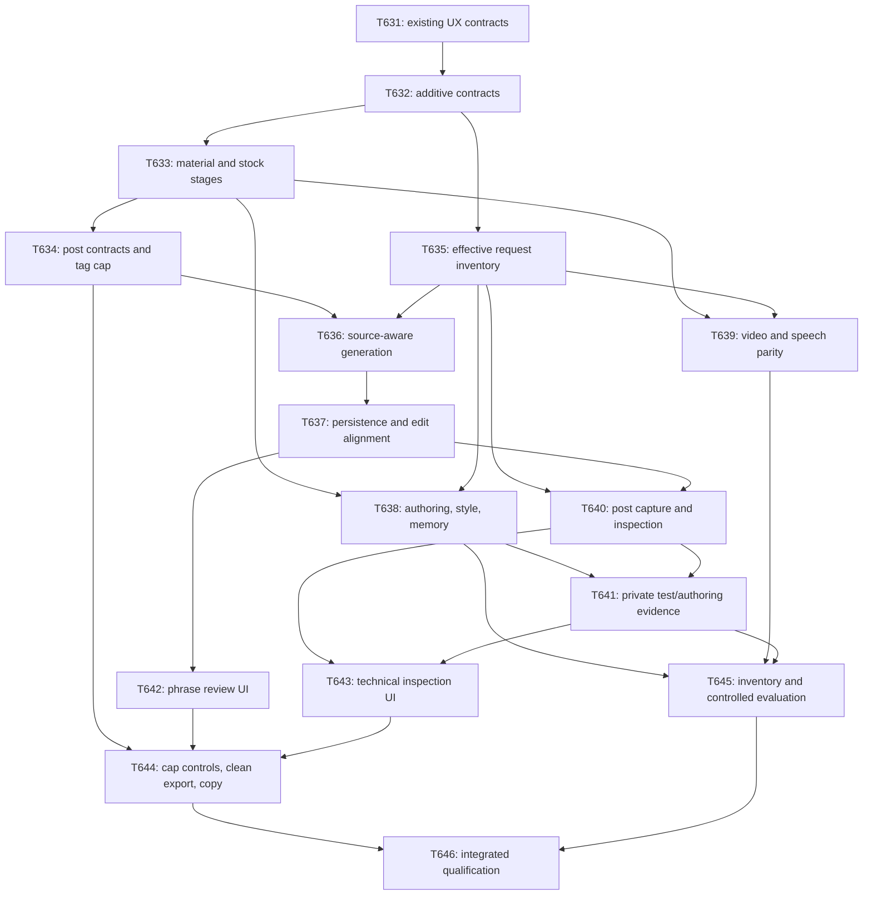

# Prompt-engineering implementation plan

The research and thirteen-domain policy conversion were committed as `536f5fdb`. This plan consumes those deltas into T632–T646. Behavior remains defined by SSOT; transport and persistence formats are implemented in their owning domain/proto/schema code.

The current execution policy is ARCH-70: one dependency-ready task in the existing main checkout, completed, verified and committed before the next task. The graph expresses prerequisites, not parallel worker assignments.

## Tasks and results

| Task | Result | Prerequisites |
|---|---|---|
| [T632](../../spec/tasks/T632.writing-origin-and-inspection-seams.md) | Additive origin/source and safe request-inspection seams, shared Unicode/quote fixtures | T631 |
| [T633](../../spec/tasks/T633.typed-material-and-stock-rule-stages.md) | Distinguishable template literal/instruction/facts and declared stock guideline stages | T632 |
| [T634](../../spec/tasks/T634.post-prompt-contracts-and-tag-cap.md) | Consistent post stage contracts, photo chronology safeguard and maximum grounded tags | T633 |
| [T635](../../spec/tasks/T635.effective-request-inventory.md) | Real composer inventory and effective prepared/dispatched request projection | T632 |
| [T636](../../spec/tasks/T636.source-aware-generation.md) | Existing model calls produce optional source candidates and preserve plan/revision lineage | T634 T635 |
| [T637](../../spec/tasks/T637.origin-storage-and-edit-alignment.md) | Current-result origin persistence, manual-edit alignment, atomic publication and deletion | T636 |
| [T638](../../spec/tasks/T638.authoring-style-memory-composers.md) | Kind/mode-specific setting, style and memory composition without duplicate workflows | T633 T635 |
| [T639](../../spec/tasks/T639.video-and-speech-prompt-parity.md) | Existing video/speech stage responsibility and inventory parity | T633 T635 |
| [T640](../../spec/tasks/T640.post-request-capture-and-inspection.md) | Owner post current/prepared/captured request reads and private capture | T635 T637 |
| [T641](../../spec/tasks/T641.test-and-authoring-private-evidence.md) | Authoring/test inspection, blind source restrictions and thirty-day payload purge | T638 T640 |
| [T642](../../spec/tasks/T642.phrase-origin-review-editor.md) | Accessible default phrase review, source details and editor continuity | T637 |
| [T643](../../spec/tasks/T643.owner-prompt-inspection-ui.md) | Named optional technical request views with truthful status and server-enforced privacy | T640 T641 |
| [T644](../../spec/tasks/T644.maximum-tags-clean-export-copy.md) | Maximum tag controls, clean copy/export and shipped owner-control/QUAL wording | T634 T642 T643 |
| [T645](../../spec/tasks/T645.prompt-contract-and-language-evaluation.md) | Actual-composer fixtures/inventory and controlled instruction-language evaluation | T638 T639 T641 |
| [T646](../../spec/tasks/T646.owner-controlled-writing-qualification.md) | Integrated behavioral, privacy, editor/export and browser qualification | T636 T637 T639 T641 T642 T643 T644 T645 |

## Engineering decisions

- Canonical PostContent stays flat and free of source markers; origin information is a separate current-result revision/hash sidecar.
- Economical models return optional field/quote/source candidates. Code derives half-open Unicode-scalar ranges, checking exact text and zero-based occurrence; ambiguous or invalid candidates remain unconfirmed. It does not certify semantic truth.
- Every human-readable field is addressed, including title, summary, tags, list items and media alt/captions. Normalization/filtering/reordering must map locators or invalidate only affected annotations.
- Manual edits preserve provably unchanged origins; Save itself, punctuation, a moved photo or plan approval cannot promote AI meaning. New explicit material and uncertain replacements are distinguished by the server, without an extra model judge or publish gate.
- Source evidence records the actual supplied frozen material and is never retargeted to a later edited/deleted row. Revision does not reintroduce raw memories.
- Effective request witnesses come from the real dispatch path, after resolution, rather than a replay of present configuration. Absence remains unavailable; llm owns no account storage and prompts enter no ordinary logs.
- Stock-rule stage filtering uses code-owned stable keys/metadata. All scope-resolved owner rules retain their verbatim text/order; useful long rules remain.
- Developer inventory covers completion and typed speech operations, including retained admitted-only helper/correction paths. Customer private inspection is scoped to the selected post, authoring and writing-test behavior; video UI is not expanded.
- Actual APIs, versioned codecs and schemas are published by foundation/producer tasks before consumers. Task notes are implementation instructions, not another permanent product-policy authority.

## Existing work and scope

T622–T631 already own navigation, durable authoring, accepted voice versions, frozen writing-test inputs, tournaments and target-domain publication. This conversion creates follow-up features instead of repeating those acceptance contracts. T632 waits for completed T631 wiring/contracts; the implementation must verify archived dependency tasks and actual main code rather than treating a CLI ready/integrated attempt as completion.

Use ARCH@20 and complete one dependency-ready task at a time on main. Current STATE, task completion records and referenced SSOT govern execution. Existing UX requirements and the new semantic-origin tasks retain their declared dependencies.

Only the thirteen prompt-engineering domain deltas are consumed here. ARCH's verification/workflow bookkeeping is handled by its separate policy update; the older INFRA/browser-media plan retains its own scope. No new implementation, deployment, provider call or private live input access is performed by this decomposition.

## Verification and execution

Each task names meaningful behavioral tests and relevant consumers; implementation completion uses ARCH-24 and records its selected commands/rationale. Full CI plus applicable deploy/media gates are a later pre-push obligation under ARCH-31. The final qualification does not require rerunning unrelated media gates for each task.

Planning checks cover all51 policy changes against task references, exact STATE/task base/dependency agreement, globally unique IDs, acyclic dependencies, real SSOT references, local links, no template placeholders and diff/spec lint. Independent backend and frontend reviews identified and resolved the retained-template inventory gap and origin-only truncated-tail parsing boundary. Annotation overhead follows existing bounded admission/accounting; no second call repairs it.

Live origin accuracy, low-cost JSON success, Korean/English prose quality and owner-observed traffic remain empirical results. T645 defaults to offline zero-call fixtures; any live execution requires explicit bounded admission/metering and reports missing evidence as unverified.

## Policy coverage

| Domain | Consumed revision | Follow-up tasks |
|---|---|---|
| GEN | r26 | T632 T633 T634 T635 T636 T637 T638 T639 T640 T641 T642 T644 T645 T646 |
| POST | r36 | T632 T634 T636 T637 T640 T641 T642 T643 T644 T646 |
| GUIDE | r17 | T633 T634 T638 T639 |
| TMPL | r25 | T633 T638 T643 T644 |
| VOICE | r15 | T636 T638 |
| MEM | r7 | T636 T637 T638 T641 |
| MODEL | r35 | T632 T635 T636 T637 T638 T639 T640 T641 T643 T645 T646 |
| EDIT | r4 | T638 T641 T643 |
| LANG | r9 | T634 T645 T646 |
| THEME | r29 | T642 T643 T644 T646 |
| EXPORT | r11 | T642 T644 T646 |
| MKT | r10 | T644 T646 |
| QUAL | r8 | T644 T645 |

Planning verification passed: `pnpm exec haeram-spec-creator lint` (exit0;136 history/freshness warnings and13 editorial hints), `python3 /tmp/postpilot-verify-prompt-tasks-261007.py` (15 IDs,51 deltas, STATE/base/dependency/reference/coverage/link checks), and `git diff --check`. These verify planning documents, not future product behavior.
